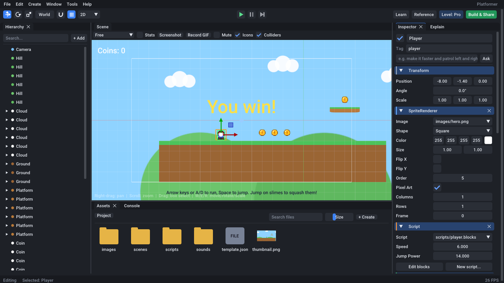
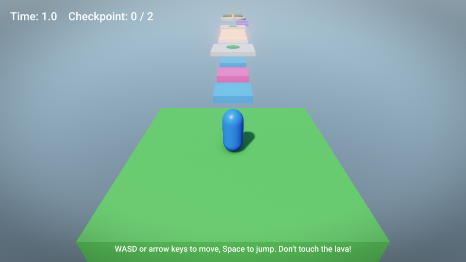
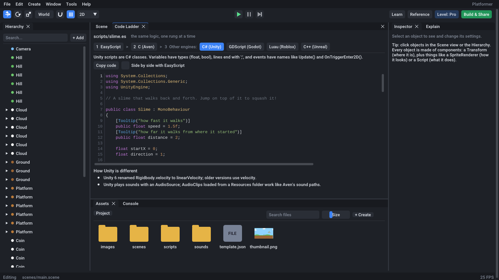

# Aven

A 2D and 3D game engine for beginners who want to make real games, and then keep growing.

You can start the way Roblox and Scratch start: pick a template, press Play, snap blocks together.
From there Aven teaches its way up. Blocks become EasyScript, a Python-like language. EasyScript
becomes C in Aven's native tier, and the **Code Ladder** shows the same script as C# for Unity,
GDScript for Godot, Luau for Roblox and C++ for Unreal. By the time you outgrow Aven, you already
know how the bigger engines think.



## What's inside

**The engine**
- **2D:** sprites and sprite sheets, tilemaps, text, particles, and Box2D physics.
- **3D:** a PBR renderer with shadows, a sky and fog, glTF models with animation, and Jolt physics
  with a character controller.
- **Post-processing:** bloom, tonemapping, color grading, vignette, SSAO and FXAA.
- **Game UI:** text, buttons, panels and anchors.
- **Audio:** 2D and 3D sound and music.
- **Saving:** save data for games.
- **The rest:** scenes, prefabs, an object hierarchy, and an ECS with reflection, so every
  component shows up in the Inspector and in scripts.
- **Three ways to code, one runtime:**
  - **Blocks** snap together like Scratch.
  - **EasyScript** is Python-like, with events such as `on_update(dt)` and `wait()`.
  - **Native C/C++** is a stable C API (`sdk/include/aven.h`). It uses EasyScript's names, so
    `aven_get(self, "x")` does what `self.x` does.
- **Behaviors** give an object gameplay with settings instead of code: platformer and top-down
  controllers, collectibles, hazards, health, spawners, scene links and more.
- **Runs on:** Windows, macOS and Linux, plus a WebGL2 player for browsers.

**The editor**, a full editor rather than a viewer:
- **Scene work:** a hierarchy, Inspector, scene view with gizmos, assets browser, console, undo
  history, find in project, a command palette and a profiler.
- **Code:** a code editor with autocomplete and error markers, and a block editor.
- **Sharing:** export to desktop, the web and itch.io.
- **Creator tools:**
  - A Pixel Editor with animation frames and onion skin.
  - A Sprite Sheet slicer and animator.
  - A Tile Painter with a starter tileset.
  - An sfxr-style Sound Maker.
  - Particle presets.
  - Screenshot and GIF capture.
- **Personalization:** themes, accent colors, font sizes and UI scale, rebindable shortcuts and
  layouts.

**Features built for beginners**
- **Learn mode** reveals the editor a level at a time: Starter, Explorer, Creator, then Pro.
- **Game recipes** build a playable game from a few choices, such as "a platformer where you
  collect coins and avoid spikes".
- **The Error Doctor** explains errors in plain words, points at the line, and offers a fix.
- **Play-and-edit** lets you pause the game, change anything, then keep or undo your changes.
- **Ask Aven** is a natural-language Inspector ("make it faster and bouncier").
- **Explain my game** describes what any object, or the whole game, does and how the parts
  connect.
- **The Code Ladder** shows one script, one rung at a time: behavior or blocks, EasyScript, C,
  then Unity, Godot, Roblox and Unreal.
- **Shareable game cards** are a picture with a QR code. With one-button web builds, anyone on
  your Wi-Fi can play from a link.
- **Bug replay** records the last 20 seconds and replays a crash or bug exactly. It can save a bug
  report.
- **Contributor quests** are small, guided ways to help improve Aven itself.

| 3D: the Obby template | The Code Ladder |
|---|---|
|  |  |

Starter templates: Blank 2D, Blank 3D, Platformer, Gem Quest (top-down), Space Shooter, Cookie
Clicker, 3D Obby and Crystal Forest (3D exploring).

## Building

You need CMake 3.21+, a C++20 compiler and Git. The other libraries are downloaded on the first
configure.

- **Linux:** also the X11/Wayland development packages GLFW needs, for example `libx11-dev
  libxrandr-dev libxinerama-dev libxcursor-dev libxi-dev libgl-dev`.
- **Windows:** Visual Studio 2022.
- **macOS:** Xcode.

```sh
cmake -S . -B build -DCMAKE_BUILD_TYPE=Release
cmake --build build --config Release
./build/bin/aven-editor           # the editor (opens the project hub)
./build/bin/aven_tests            # the test suite
```

What gets built:

| Program | What it is |
|---|---|
| `aven-editor` | The editor. `aven-editor path/to/game` opens a project directly. |
| `aven-player` | Runs a game without the editor. Exports ship this. |
| `aven_tests` | Unit and integration tests. |

For the web player, see [docs/getting-started.md](docs/getting-started.md#the-web-player). It
uses Emscripten: `tools/web/build_web_player.sh`.

## Documentation

- [Getting started](docs/getting-started.md): build, make your first game, share it.
- [EasyScript guide](docs/easyscript.md): the language.
- [EasyScript API](docs/easyscript-api.md): every function and property, generated from the
  engine.
- [Native code (C/C++)](docs/native-code.md): the C API and building modules.
- [Learning path](docs/learning-path.md): from blocks to C, and on to other engines.
- [Moving to other engines](docs/migrating.md): Unity, Godot, Roblox and Unreal, side by side.
- [Architecture](docs/architecture.md): how the code is organized.
- [Roadmap](docs/roadmap.md): what's done, and what isn't yet.
- [Contributing](CONTRIBUTING.md): how to help, starting with the in-editor Contributor Quests.

## License

MIT; see [LICENSE](LICENSE). The libraries Aven builds on are listed in
[THIRD_PARTY_NOTICES.md](THIRD_PARTY_NOTICES.md).
