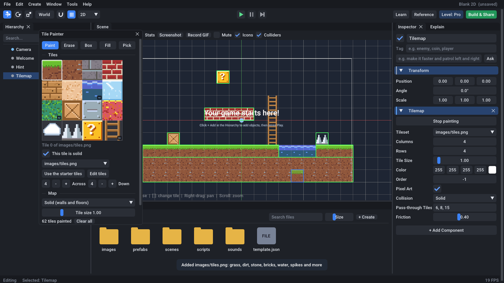

# Getting started

## 1. Build Aven

You need CMake 3.21 or newer, a C++20 compiler and Git. Aven downloads its other libraries
(GLFW, Box2D, Jolt, Dear ImGui...) the first time you configure.

| System | Install first |
|---|---|
| Windows | Visual Studio 2022 with "Desktop development with C++", and CMake |
| macOS | Xcode (or `xcode-select --install`), and CMake (`brew install cmake`) |
| Linux | `gcc` or `clang` and `cmake`, plus GLFW's dependencies, for example on Debian/Ubuntu: `sudo apt install libx11-dev libxrandr-dev libxinerama-dev libxcursor-dev libxi-dev libgl-dev libwayland-dev libxkbcommon-dev` |

```sh
git clone https://github.com/ethandadev/Aven.git
cd Aven
cmake -S . -B build -DCMAKE_BUILD_TYPE=Release
cmake --build build --config Release
```

Then start the editor: `build/bin/aven-editor`. On Windows, with Visual Studio's generator,
it's `build\bin\Release\aven-editor.exe`.

## 2. Make a game

The editor opens on the **hub**. There are three ways to start:

- **A template.** Platformer, Gem Quest, Space Shooter, Cookie Clicker, 3D Obby, Crystal Forest,
  or a blank 2D or 3D game. Each one is a complete, playable game with a short tutorial.
- **Cook from a recipe.** Answer a few questions ("a platformer where you collect gems and avoid
  enemies, easy") and Aven builds a playable game from them.
- **Open** a game you made before.

Press **Play** (or Ctrl+P) to play it inside the editor. Now change something:

1. Click an object in the scene or in the **Hierarchy**. Its settings appear in the **Inspector**.
2. Change a number, like the player's `Speed`, **while the game is paused**. That's
   play-and-edit: keep the change, or undo it when you stop.
3. Or type what you want into the box at the top of the Inspector ("make it jump higher") and
   press **Ask**.
4. Not sure what something does? Select it and open the **Explain** tab.

## 3. Add behavior

- **Behaviors** need no code. Add Component > Behaviors has a platformer controller,
  collectible, hazard, health, spawner, scene link and more. Change them with settings.
- **Blocks:** Add Component > Script, then **New script... > Blocks**. Drag blocks from the
  left, starting with an event like "when game starts".
- **EasyScript:** the same, choosing EasyScript. See the [EasyScript guide](easyscript.md).

Right-click any behavior and choose **Show as code** to see the script that does the same job.
That's the first step of the [learning path](learning-path.md).

## 4. Make it yours

The **Tools** menu has creators for your own content:

- **Pixel Editor:** draw sprites and animation frames.
- **Sprite Sheet and Animation:** cut an image into frames and animate them.
- **Tile Painter:** paint levels from tiles. Create > Tilemap, then paint in the scene.
- **Sound Maker:** retro sound effects from presets and sliders.
- **Screenshot** (F12) and **Record GIF** (Shift+F12).



## 5. Share it

Press **Build & Share**:

- **This computer:** a folder with your game and the player, ready to zip and send to friends
  (Windows, macOS or Linux, whichever you're on).
- **Web browser:** a web version that runs in any modern browser. It needs the web player (see
  below).
- **Share:** a game card picture with a QR code, a link anyone on the same Wi-Fi can open, and a
  zip ready to upload to itch.io.

Aven doesn't host games on the internet itself. For a public link, upload the web build or the
itch.io zip to a free host such as itch.io or GitHub Pages.

### The web player

The web export needs Aven's player compiled to WebAssembly, once, with
[Emscripten](https://emscripten.org):

```sh
source /path/to/emsdk/emsdk_env.sh
tools/web/build_web_player.sh
```

This puts `aven-player.js`, `aven-player.wasm` and `index.html` in `build/bin/web`, where the
editor finds them. Native (C/C++) behaviors don't run on the web.

## 6. Learn more as you go

The **Level** button (top right) sets how much of the editor you see: **Starter**, **Explorer**,
**Creator** or **Pro**. Aven suggests the next level as you use more features. Everything is
still there when you move up; there's just more of it. See the [learning path](learning-path.md).
