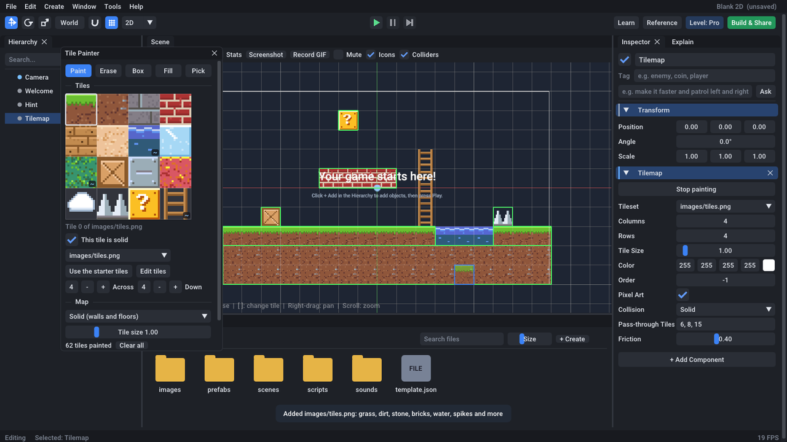

# Getting started

## 1. Build Aven

You need CMake 3.21 or newer, a C++20 compiler and Git. Aven downloads its other libraries
(GLFW, Box2D, Jolt, Dear ImGui...) the first time you configure.

| System | Install first |
|---|---|
| Windows | Visual Studio 2022 with "Desktop development with C++", and CMake |
| macOS | Xcode (or `xcode-select --install`), and CMake (`brew install cmake`) |
| Linux | `gcc` or `clang` and `cmake`, plus GLFW's dependencies, for example on Debian/Ubuntu: `sudo apt install libx11-dev libxrandr-dev libxinerama-dev libxcursor-dev libxi-dev libgl-dev libwayland-dev libxkbcommon-dev` |

```sh
git clone https://github.com/ethandadev/Aven.git
cd Aven
cmake -S . -B build -DCMAKE_BUILD_TYPE=Release
cmake --build build --config Release
```

Then start the editor: `build/bin/aven-editor`. On Windows, with Visual Studio's generator,
it's `build\bin\Release\aven-editor.exe`.

## 2. Make a game

The editor opens on the **hub**. There are three ways to start:

- **A template.** Platformer, Gem Quest, Space Shooter, Cookie Clicker, 3D Obby, Crystal Forest,
  or a blank 2D or 3D game. Each one is a complete, playable game with a short tutorial.
- **Cook from a recipe.** Answer a few questions ("a platformer where you collect gems and avoid
  enemies, easy") and Aven builds a playable game from them.
- **Open** a game you made before.

Press **Play** (or Ctrl+P) to play it inside the editor. Now change something:

1. Click an object in the scene or in the **Hierarchy**. Its settings appear in the **Inspector**.
2. Change a number, like the player's `Speed`, **while the game is paused**. That's
   play-and-edit: keep the change, or undo it when you stop.
3. Or type what you want into the box at the top of the Inspector ("make it jump higher") and
   press **Ask**.
4. Not sure what something does? Select it and open the **Explain** tab.

Working with several objects: Ctrl+click adds one to the selection, Shift+click (or Shift and the
arrow keys in the Hierarchy) selects a range, and dragging in an empty part of the scene box-selects.
Whatever you then do (move, drag into a folder, delete, duplicate, Add Component, change a setting in
the Inspector) happens to all of them, as one undo step. In the Hierarchy the arrow keys move
through the list, Left and Right close and open folders, and Esc selects nothing.

## 3. Add behavior

- **Behaviors** need no code. Add Component > Behaviors has a platformer controller,
  collectible, hazard, health, spawner, scene link and more. Change them with settings.
- **Blocks:** Add Component > Script, then **New script... > Blocks**. Drag blocks from the
  left, starting with an event like "when game starts".
- **EasyScript:** the same, choosing EasyScript. See the [EasyScript guide](easyscript.md).

Right-click any behavior and choose **Show as code** to see the script that does the same job.
That's the first step of the [learning path](learning-path.md).

**Buttons and menus without code.** Every UI Button comes with **Click Actions**: a list of
steps that run when it's clicked. Click **+ Add step** and pick one: load a scene, restart,
quit, pause or resume, show or hide an object (like a menu panel), play a sound, set or add to
a game value, spawn a prefab, destroy an object, send a message or call a script function.
Click Actions work on objects in the world too. For a head start, **Create > UI** has a Start
Menu, a Pause Menu, a Health Bar and Score Text that already work.

**Inspector tips:**
- Right-click a setting's name to reset it, or to copy it and paste it somewhere else.
- On a prefab copy, settings that differ from the prefab have a bold name and a colored bar.
- The padlock next to the name keeps the Inspector on one object while you select others.
- Select several objects to change them all at once.

## 4. Make it yours

**Ready-made art:** open **Tools > Asset Library** (or the **Library** button in Assets). Click an
item to place it, drag it to where you want it, or right-click to only add it to the project.
Textures dropped on a 3D object cover it; models get a collider that fits them. Everything in the
library is free to use in any game, including ones you sell.


The **Tools** menu has creators for your own content:

- **Pixel Editor:** draw sprites and animation frames.
- **Sprite Sheet and Animation:** cut an image into frames and animate them.
- **Tile Painter:** paint levels from tiles. Create > Tilemap, then paint in the scene.
- **Sound Maker:** retro sound effects from presets and sliders.
- **Screenshot** (F12) and **Record GIF** (Shift+F12).



## 5. Share it

Press **Build & Share**:

- **Desktop apps:** your game as a Windows program (with its icon in the .exe), a macOS app and a
  Linux program, each in a zip ready to upload. Any computer can make all three: Aven's downloads
  carry the player for each system in `players/`. (A build of Aven you compiled yourself has only
  its own system's player.)
- **Game details:** the name, version, description, who made it, website and copyright, the app
  icon (any picture in your project; empty uses a picture of the start scene), a moment of "Made
  with Aven" when the game starts (any key skips it), and an optional title screen with Play and
  Quit over the game's thumbnail or a picture you pick.
- **Web browser:** a web version that runs in any modern browser. It needs the web player (see
  below).
- **Share:** a game card picture with a QR code, a link anyone on the same Wi-Fi can open, and a
  zip ready to upload to itch.io.

**Signing** (Desktop apps > Signing) stops "unknown developer" warnings:

- **macOS:** on a Mac with Xcode's command-line tools, enter your Apple Developer **Team ID**; Aven
  signs with your "Developer ID Application" certificate from the keychain. To also notarize (so
  the app opens on any Mac without a warning), run once in Terminal
  `xcrun notarytool store-credentials MyProfile --apple-id you@example.com --team-id TEAMID` and
  enter `MyProfile` as the notary profile. Without a Team ID, apps are signed ad hoc: they run, but
  other Macs ask first (right-click > Open). macOS apps can only be signed on a Mac.
- **Windows:** a code signing certificate as a `.pfx` file (its password is asked for each time and
  never saved) or a certificate thumbprint from the Windows certificate store. Aven runs `signtool`
  from the Windows SDK, or `osslsigncode` (on any system).

To share the project itself (so someone can open and change it in Aven), use **File > Export
Project as .zip**. They open the zip from **Open a game** in the start screen, or drop it on the
Aven window; Aven unpacks it next to the zip and opens it. Compiled native code isn't included:
it's rebuilt, and Aven asks before running native code from someone else's project.

Aven doesn't host games on the internet itself. For a public link, upload the web build or the
itch.io zip to a free host such as itch.io or GitHub Pages.

### The web player

The web export needs Aven's player compiled to WebAssembly, once, with
[Emscripten](https://emscripten.org):

```sh
source /path/to/emsdk/emsdk_env.sh
tools/web/build_web_player.sh
```

This puts `aven-player.js`, `aven-player.wasm` and `index.html` in `build/bin/web`, where the
editor finds them. Native (C/C++) behaviors don't run on the web.

## 6. Learn more as you go

The **Level** button (top right) sets how much of the editor you see: **Starter**, **Explorer**,
**Creator** or **Pro**. Aven suggests the next level as you use more features. Everything is
still there when you move up; there's just more of it. See the [learning path](learning-path.md).
